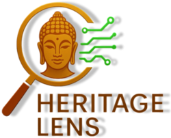
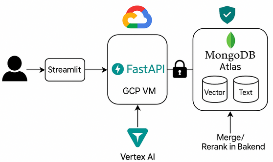
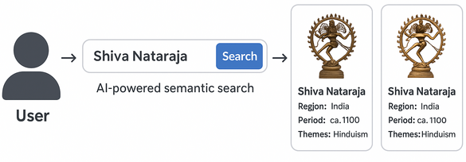
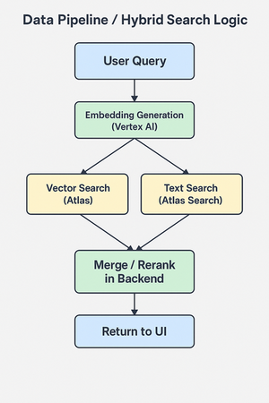

# Heritage Lens



---

## 📑 Table of Contents

1. [Inspiration](#inspiration)
2. [What It Does](#what-it-does)
3. [High-Level Architecture](#high-level-architecture)
4. [User Experience](#user-experience)
5. [How I Built It](#how-i-built-it)
6. [Data Pipeline / Hybrid Search Diagram](#data-pipeline--hybrid-search-diagram)
7. [What I Learned](#what-i-learned)
8. [Challenges](#challenges)
9. [What’s Next](#whats-next)
10. [Installation Guide & Code Walkthrough](#installation-guide--code-walkthrough)
    - [1. Infrastructure Provisioning (Terraform)](#1-infrastructure-provisioning-terraform)
    - [2. Application Setup](#2-application-setup)
    - [3. Running the Backend](#3-running-the-backend)
    - [4. Running the UI](#4-running-the-ui)
    - [5. Data Preparation & Embeddings](#5-data-preparation--embeddings)
    - [Code Walkthrough](#code-walkthrough)
    - [Deployment & URLs](#deployment--urls)

---

## 🌍 Inspiration

Having travelled to multiple countries and explored some of the world’s most iconic museums—including the Louvre Museum in Paris and the British Museum in London—I’ve always been fascinated by how cultural heritage connects us all. The thrill of wandering through galleries, discovering ancient artifacts, and imagining their stories made me wish for a way to recreate that sense of discovery online, powered by AI.

 

When I saw the hackathon’s challenge to blend Google Cloud and MongoDB Atlas, I immediately thought: *Why not build a tool that brings this global exploration to everyone—no matter where they are?* That was the spark behind **Heritage Lens**.

---

## 🔍 What It Does

**Heritage Lens** lets users discover artifacts from public datasets simply by describing them—just like you’d do when talking to a guide in a museum. It uses:

- Semantic search via Vertex AI
- Text search via MongoDB Atlas
- A hybrid scoring mechanism to combine both

---

## 🧭 High-Level Architecture



**Stack Overview**:

- **Frontend**: Streamlit
- **Backend**: FastAPI
- **AI Embeddings**: Google Vertex AI
- **Database**: MongoDB Atlas (text + vector search)
- **Infra**: GCP Compute Engine, Nginx, Certbot, Secret Manager

---

## 🎨 User Experience



Flow:  
User enters a query → AI-powered hybrid search → Artifact results with images/descriptions

---

## ⚙️ How I Built It

- **Backend:** Python & FastAPI for APIs and hybrid search logic
- **Frontend:** Streamlit for a beautiful, responsive web experience
- **AI/Embeddings:** Google Vertex AI for semantic embeddings
- **Database:** MongoDB Atlas, using both vector and text indexes
- **Hybrid Search:** Python merges and reranks vector and text search results for the best user experience
- **Deployment:** GCP Compute Engine, Nginx as reverse proxy, Certbot & Secret Manager for automated SSL, Terraform for IaC
- **CI/CD:** GitHub for source control 
---

## 🔁 Data Pipeline / Hybrid Search Diagram



1. User query →  
2. Generate semantic embeddings via Vertex AI →  
3. Parallel vector + text search in MongoDB Atlas →  
4. Re-rank and return the results to frontend

---

## 🧠 What I Learned

- **Semantic AI unlocks true exploration:** Vertex AI and MongoDB vector search allow natural language queries, not just keywords.
- **Hybrid search is a superpower:** Combining classic and semantic search brings both intuition and precision.
- **Cloud automation:** Using Secret Manager, Certbot, and Terraform made the stack robust and reproducible.
- **Adaptability:** On the last hackathon day, I bought the new domain [heritage-lens.org]. While the domain is very new and may be blocked in some regions, I also deployed the project on my main domain for redundancy: [https://heritage.mayurpawar.com](https://heritage.mayurpawar.com).

---

## 🧱 Challenges

- Cleaning and embedding large public datasets
- Optimizing relevance scoring across modalities
- Handling SSL for multiple domains
- Shipping a full AI stack in limited time

---

## 🚀 What’s Next

- Add image search and multilingual capabilities
- Expand artifact datasets and allow public curation
- Usage analytics for curators and educators

---

## 🛠️ Installation Guide & Code Walkthrough

This project is open source and can be deployed on Google Cloud using Terraform. Make sure that you have terraform installed on your system or have terraform image if you are using K8S hosted provisioning pipelines.

---

### 1. Infrastructure Provisioning (Terraform)

Terraform scripts are in [`infra/`](https://github.com/mayurpawar/heritage-lens/tree/main/infra)

They provision:

- Compute Engine VM
- VM Template with VM Group so that zero downtime deployments can be achieved
- Network/firewall rules
- Installing all OS and python dependencies 
- Secrets integration
  
Update terraform.tfvars.example file with your actual values such as CIDR range, VM image type, domain if available. If domain is not available, you still can acces your app using public IP of your VM. 

**To deploy:**

```bash
git clone https://github.com/mayurpawar/heritage-lens.git
cd heritage-lens/infra
mv terraform.tfvars.example terraform.tfvars
terraform init
terraform apply
```
---

### 2. Application Setup

✅ These steps are executed during step 1 when VM starup script runs and hence no need to execute. Adding it here for info and debugging if required.
SSH into the provisioned VM and set up the application: 

```bash
git clone https://github.com/mayurpawar/heritage-lens.git
cd heritage-lens
```

Create and activate a Python virtual environment:

```bash
python3 -m venv venv
source venv/bin/activate
pip install -r requirements.txt
```

Set environment variables manually or create a `.env` file:

```bash
export MONGODB_URI="mongodb+srv://<your-connection>"
export GOOGLE_APPLICATION_CREDENTIALS="/path/to/your-service-account.json"
```

---

### 3. Running the Backend

✅ These steps are executed during step 1 when VM starup script runs and hence no need to execute. Adding it here for info and debugging if required.
Start the FastAPI backend server:

```bash
cd app
uvicorn app.main:app --host 0.0.0.0 --port 8000
```

Key endpoints:

- `/api/explorer/search` — Hybrid semantic+text search endpoint
- `/docs` — Interactive OpenAPI documentation (Swagger UI)

---

### 4. Running the UI

✅ These steps are executed during step 1 when VM starup script runs and hence no need to execute. Adding it here for info and debugging if required.
Start the Streamlit frontend:

```bash
cd ui
streamlit run app.py --server.port 8501
```

> Nginx (configured via the Terraform startup script) will automatically route traffic from ports 80/443 to FastAPI and Streamlit services. SSL is handled by Certbot.

---

### 5. Data Preparation & Embeddings

Run the embedding script to process artifact data using Vertex AI:

```bash
python ai_loader/load_artifacts_to_mongo.py // This will load data to mongoDB. You can keep data files in ../data directory.
python ai_loader/batch_embed_vertex.py      // This will add embedding to your mongoDB database in batches.
```

> ⚠️ Ensure your Google Cloud service account has the following permissions:
> - Vertex AI (for embedding generation)
> - Cloud Storage (if needed)
> - Secret Manager (if you're loading secrets)

This script:
- Fetches artifacts from MongoDB
- Sends text to Vertex AI for embedding
- Updates MongoDB documents with embeddings

---

### Code Walkthrough of Important files

```bash
heritage-lens/
├── app/                # FastAPI backend
│   ├── main.py
│   ├── routes/
│   │    └── explorer.py   # Hybrid search endpoint
│   ├── services/
│   │    ├── db.py         # MongoDB client
│   │    └── vertexai.py   # Vertex AI interface
├── ui/                 # Streamlit UI
│   └── app.py
│   └── assets          # Holds required media files 
├── ai_loader/          # Embedding & data scripts
│   └── batch_embed_vertex.py
├── infra/              # Terraform infrastructure
│   └── main.tf
├── requirements.txt
└── README.md
```

**Notable Files:**

- `app/routes/explorer.py` — Main hybrid search route  
- `app/services/vertexai.py` — Embedding logic via Vertex AI  
- `app/services/db.py` — MongoDB Atlas connector  
- `ui/app.py` — Streamlit user interface logic  
- `ai_loader/batch_embed_vertex.py` — Embedding generation script  
- `infra/main.tf` — Provision VM, SSL, and setup scripts  

---

### Deployment & URLs

- **Primary Domain**: [https://heritage-lens.org](https://heritage-lens.org)
- **Backup Domain**: [https://heritage.mayurpawar.com](https://heritage.mayurpawar.com)

> DNS and SSL provisioning may take a few minutes post-deployment. Check SSL status with your browser or run `curl -I https://heritage-lens.org`.

